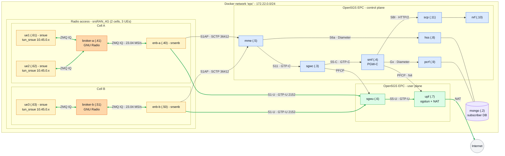

# 4G LTE Stack: Architecture & Validation Guide

This document explains the fully-virtual 4G LTE network in `deploy/4g/`: what each container does, how they connect, and how to bring the stack up and validate. The validation consists of the one-shot `make 4g-auto` acceptance test and by performing each step manually so you can watch the signaling happen.

It maps directly onto the theory in [`THEORY.md`](THEORY.md) (Chapters "4G Components", "LTE Data Plane", "LTE Control Plane", and "LTE Association and mobility").

> **No RF, no radio law.** There is no over-the-air transmission. The "radio" between the base station and the phone is a virtual link carrying IQ samples over TCP (ZeroMQ). The "phone" is a software UE. Everything runs in Docker on one host.

---

## 1. What the stack is

Two open-source projects, built from source into local images (see `deploy/images/`):

- **Open5GS**: the mobile core (EPC). Provides every 4G network function.
- **srsRAN_4G**: the radio access side: a software eNodeB (`srsenb`) and a software UE (`srsue`) that talk to each other over a **ZMQ virtual radio** instead of real RF.

A single **MongoDB** stores subscriber records (the "SIM database").

All services for now run on one Docker bridge network, `172.22.0.0/24`, with **static IPs** so that Diameter, GTP-U, PFCP and SBI endpoints are deterministic (see the IP map below).

---

## 2. Architecture



Blue = control plane (signaling), green = user plane (the actual data path), orange = radio access (the two GNU Radio brokers sit on the virtual-radio path between each eNB and its UEs). All three UEs share the one (unchanged) EPC.

**A deliberate deviation from a real UE:** each `ue`/`ue1`/`ue2`/`ue3` container has a second interface, `eth0`, that a real phone has no equivalent of. In this lab it exists only to carry the simulated ZMQ RF link to its eNB/broker over the `epc` Docker network. Left alone, that network gives every container real internet access via Docker's own NAT, independent of anything happening at the cellular layer, which would make `telcoctl suspend` (which tears down the S1-U/GTP bearer) invisible to a UE using ordinary, non interface-bound traffic. `deploy/4g/scripts/ue-entrypoint.sh` closes that gap: `eth0` is iptables-locked to the `epc` subnet only (the RF link keeps working, nothing else can leave via it), and a default route via `tun_srsue` is maintained for as long as the PDU session is up. Net effect: internet reachability is gated entirely by the cellular attach state, matching a real phone having no data path at all while detached or barred (not a degraded one).

**A suspended UE recovers on its own once resumed, no container recreate involved.** `suspend`'s live detach only tears down the S1-U/GTP bearer and NAS/EMM session, it never touches the ZMQ radio link, so the `enb`/`ue`/`broker` processes stay up throughout. The UE's own NAS stack retries attaching immediately per `REATTACH_REQUIRED`; while still suspended that retry is rejected (EMM cause #8), and the UE falls back to periodically retrying via the 3GPP `T3402` timer until an attempt succeeds (`srsue/src/stack/upper/nas.cc`'s `parse_attach_reject`, `t3402_duration_ms` in `nas.h` has been shortened to 15s in this lab; spec default is 12 minutes). `resume` a subscriber and the UE typically regains connectivity within ~20-25s on its own, with no effect on other UEs sharing its cell/broker.

### IP / port map

| Service | IP | Role | Key interfaces |
|---|---|---|---|
| `mongo` | 172.22.0.2 | Subscriber database (the SIM store) | MongoDB 27017 |
| `sgwc`  | 172.22.0.3 | Serving GW control plane | GTP-C, PFCP |
| `smf`   | 172.22.0.4 | Session Mgmt (PGW-C): IP alloc, sessions | GTP-C, PFCP, Gx, SBI |
| `mme`   | 172.22.0.5 | Mobility Mgmt: control-plane brain | S1AP 36412, S11, S6a |
| `sgwu`  | 172.22.0.6 | Serving GW user plane | GTP-U 2152 |
| `upf`   | 172.22.0.7 | User Plane (PGW-U): the gateway to the Internet | GTP-U, `ogstun`, NAT |
| `hss`   | 172.22.0.8 | Home Subscriber Server: auth + subscriber data | S6a (Diameter) |
| `pcrf`  | 172.22.0.9 | Policy & Charging Rules | Gx (Diameter) |
| `nrf`   | 172.22.0.10 | NF Repository (service discovery, 5G-style) | SBI (HTTP/2) |
| `scp`   | 172.22.0.11 | Service Communication Proxy | SBI (HTTP/2) |
| `enb-a` | 172.22.0.40 | Software eNodeB (cell A base station) | S1AP, S1-U, ZMQ |
| `broker-a` | 172.22.0.41 | GNU Radio broker for cell A (sums UL IQ, fans out DL IQ) | ZMQ IQ |
| `enb-b` | 172.22.0.50 | Software eNodeB (cell B base station) | S1AP, S1-U, ZMQ |
| `broker-b` | 172.22.0.51 | GNU Radio broker for cell B | ZMQ IQ |
| `ue1`   | 172.22.0.61 | Software UE on cell A (the "phone") | ZMQ, `tun_srsue` |
| `ue2`   | 172.22.0.62 | Software UE on cell A | ZMQ, `tun_srsue` |
| `ue3`   | 172.22.0.63 | Software UE on cell B | ZMQ, `tun_srsue` |
---

## 3. Role of each container

### Core: control plane

- **`mme` (Mobility Management Entity).** The control-plane brain. Terminates S1AP from the eNB, runs the NAS Attach procedure, authenticates the UE (fetching vectors from the HSS over **S6a/Diameter**), and sets up the data path via **S11/GTP-C** to the SGW-C. No user data flows through it. This maps to `THEORY.md` chapters "4G Components" and "LTE Signaling".
- **`hss` (Home Subscriber Server).** The subscriber/auth database front-end. Reads subscriber records (IMSI, Ki, OPc, APN, QoS) from MongoDB and answers the MME's S6a authentication and location queries. The 4G equivalent of the 2G HLR.
- **`pcrf` (Policy and Charging Rules Function).** Supplies QoS/charging policy to the SMF over **Gx/Diameter** when the default bearer is created.
- **`sgwc` (Serving Gateway – Control).** Control half of the SGW after CUPS split; relays session setup between MME (S11) and SMF (S5-C), and controls the SGW-U via PFCP.
- **`smf` (Session Management Function / PGW-C).** Allocates the UE's IP address (`10.45.0.0/16`), creates the PDN session/default bearer, pulls policy from PCRF (Gx), and controls the UPF via **PFCP (N4)**. This maps to `THEORY.md` chapter "4G EPC vs. 5G Core" (SMF = MME session part + PGW-C).
- **`nrf` / `scp`.** Open5GS's SMF/UPF are shared with its 5G core and use a Service-Based Interface. The **NRF** is the service-discovery registry and the **SCP** is the proxy the SMF registers through. They are required for the SMF to start cleanly even in a 4G-only deployment. This maps to `THEORY.md` chapter "5G Service-Based Architecture".

### Core: user plane

- **`sgwu` (Serving Gateway – User).** User-plane anchor between the eNB (S1-U) and the UPF (S5-U). Forwards GTP-U tunnelled traffic. Controlled by the SGW-C over PFCP.
- **`upf` (User Plane Function / PGW-U).** The exit to the Internet. Creates the `ogstun` TUN device, owns the UE IP pool gateway `10.45.0.1/16`, decapsulates GTP-U, and **NATs** UE traffic out to the real Internet (`iptables MASQUERADE`). This maps to `THEORY.md` chapters "LTE Data Plane" and "Tunneling (GTP)".

### Radio access

- **`enb-a`, `enb-b` (srsenb - software eNodeBs).** Two base stations, one per cell. Each connects to the MME over **S1AP** (SCTP 36412), carries user data over **S1-U/GTP-U**, and broadcasts the cell its UEs camp on. Their "radio" front-end is the ZMQ driver (as we have no real RF hardware); their configs are `config/multi/enb-a.conf` / `enb-b.conf`.
- **`broker-a`, `broker-b` (GNU Radio ZMQ brokers).** One virtual-radio broker per cell. A raw ZMQ link is point-to-point, so the broker is what lets **several UEs share one eNB**: it sums the UEs' uplink IQ into the eNB's single receive stream and fans the eNB's downlink IQ out to every UE. All RF endpoints run at `base_srate = 23.04 MS/s`, and a broker must start **after** its eNB and UEs (see §5.4).
- **`ue1`, `ue2`, `ue3` (srsue - software UEs).** The "phones" are `ue1`+`ue2` on cell A, `ue3` on cell B. Each runs the real UE-side stack (PHY→MAC→RLC→PDCP→RRC + NAS). Its USIM credentials live in its own `config/multi/ue*.conf`, where **this file is the actual eSIM profile**. On successful attach it creates a `tun_srsue` interface with the IP the UPF assigned. → `THEORY.md` §"LTE Association and mobility".

### Database

- **`mongo`.** Stores the subscriber documents. For now provisioned by `deploy/4g/scripts/add-subscriber.sh` (a thin wrapper over the vendored `open5gs-dbctl`). In Plan 2 this is replaced by our own Go `provisioner`.

---

## 4. The "SIM" and authentication

The subscriber is defined by values that must match on **both** sides:

| Value | What it is | Where in the core | Where in the UE |
|---|---|---|---|
| IMSI `999700000000001` | The subscriber's globally unique identity number. | `mongo` subscriber doc | `ue.conf` `[usim] imsi` |
| Ki `465B5CE8...A6BC` | The subscriber's secret authentication key, never transmitted over the air. | `mongo` subscriber doc | `ue.conf` `[usim] k` |
| OPc `E8ED289D...83CA` | Operator-specific key material combined with Ki to derive session keys. | `mongo` subscriber doc | `ue.conf` `[usim] opc` |
| PLMN `MCC 999 / MNC 70` | The identifier (country + network code) of the mobile network operator. | `mme.yaml` gummei+tai | `ue.conf` IMSI prefix + `enb.conf` mcc/mnc |
| APN `internet` | The packet data network the UE requests to be connected to. | subscriber doc + `smf.yaml` | `ue.conf` `[nas] apn` |


If Ki/OPc disagree, the Attach fails at **Authentication**. If the PLMN/TAC disagree, the eNB's **S1 Setup** is rejected before any UE can attach (see Troubleshooting).

---

## 5. Running the infra

### 5.1 Automated validation (quick)

This performs the following from a clean state automatically: build, start the full **2-cell / 3-UE** topology (see §5.4), provision the 3 subscribers, wait for every UE to attach, and ping `8.8.8.8` from each through the UPF. From the repo root do the following:

```bash
make 4g-auto
```


A successful automatic deployment looks like:

```yaml
...
Provisioned subscriber 999700000000001 (APN=internet)
./deploy/4g/scripts/wait-for-attach.sh
UE attached:  inet 10.45.0.2/24 scope global tun_srsue
docker compose -f deploy/4g/docker-compose.yml exec -T ue ping -I tun_srsue -c 4 8.8.8.8
PING 8.8.8.8 (8.8.8.8) from 10.45.0.2 tun_srsue: 56(84) bytes of data.
64 bytes from 8.8.8.8: icmp_seq=1 ttl=126 time=66.9 ms
64 bytes from 8.8.8.8: icmp_seq=2 ttl=126 time=32.4 ms
64 bytes from 8.8.8.8: icmp_seq=3 ttl=126 time=45.5 ms
64 bytes from 8.8.8.8: icmp_seq=4 ttl=126 time=52.0 ms

--- 8.8.8.8 ping statistics ---
4 packets transmitted, 4 received, 0% packet loss, time 3002ms
rtt min/avg/max/mdev = 32.363/49.196/66.854/12.416 ms
```

Tear down with:

```bash
make 4g-auto-down      # stops containers and removes the mongo volume
```

### 5.2 Partially staged deployment (infra, subscribers, device)

As a middle ground between the one-shot `make 4g-auto` and the fully by-hand walkthrough in §5.3, the deployment is also split into an **infra** stage, a **subscribers** stage, and a **device** stage on the multi-cell topology. Each prints what it is doing and which containers it starts/stops. These sit *alongside* the manual steps, not instead of them:

```bash
make 4g-infra             # EPC core + both eNBs — the operator network, NO subscribers, NO UEs
make 4g-demo-subscribers  # provision the 3 fixed subscribers with the telcoctl client
make 4g-device            # then ONE device: ue1 → sub …001 → enb-a, wait for attach, ping
make 4g-demo-devices      # or ALL THREE: ue1+ue2+ue3 + brokers, attach all

make 4g-device-down       # remove ONLY device ue1 + broker-a (infra keeps running)
make 4g-auto-down         # tear the whole stack down (infra is the foundation, so the UEs go too)
```

`make 4g-infra` deliberately provisions **nothing**, it just stands up the network (EPC core + both eNBs), the way a real operator's network exists before any SIM is sold. Subscribers are then created through the `telcoctl` client (`make 4g-infra` prints how to drive it). `make 4g-demo-subscribers` is a convenience that provisions the three fixed subscribers whose keys match `config/multi/ue*.conf`, so the devices can attach. From there, `make 4g-device` brings up a **single** device (`ue1` mapped to subscription `…001` on `enb-a`), the same one-UE-to-one-subscription-and-eNB shape a future `make 5g-device` will mirror. The `make 4g-demo-devices` command brings up all three at once (`ue1`+`ue2` on `enb-a`, `ue3` on `enb-b`) with their brokers started last.

---

### 5.3 Complete manual validation

With the steps below you can perform the automatic validation steps manually to see what happens between the components.


#### 5.3.1 First only start the core

```bash
docker compose -f deploy/4g/docker-compose.yml up -d mongo provisioner nrf scp hss pcrf sgwc sgwu upf smf mme
docker compose -f deploy/4g/docker-compose.yml ps
```

All services should be `running` and `mongo` should say `healthy`.


#### 5.3.2 Confirm the core's internal links came up

**Diameter (S6a MME - HSS, Gx SMF - PCRF):**
```bash
docker compose -f deploy/4g/docker-compose.yml logs mme hss smf pcrf | grep "CONNECTED TO"
```
Expect four lines: MME - `hss.localdomain`, HSS - `mme.localdomain`, SMF - `pcrf.localdomain`,
PCRF - `smf.localdomain`.

**PFCP (SGW-C - SGW-U, SMF - UPF):**
```bash
docker compose -f deploy/4g/docker-compose.yml logs | grep "PFCP associated"
```

Expect associations between `.3 - .6` and `.4 - .7`.

**SBI (SMF registers with NRF via SCP):**
```bash
docker compose -f deploy/4g/docker-compose.yml logs smf | grep "NF registered"
```

#### 5.3.3 Provision a subscriber

```bash
make telcoctl   # builds ./bin/telcoctl, if not already built

TELCOCTL_SERVER=http://127.0.0.1:8080 TELCOCTL_TOKEN=dev-operator-token \
  ./bin/telcoctl add --imsi 999700000000001 \
    --ki 465B5CE8B199B49FAA5F0A2EE238A6BC \
    --opc E8ED289DEBA952E4283B54E88E6183CA \
    --apn internet --reason NEW_ACTIVATION

# verify:
TELCOCTL_SERVER=http://127.0.0.1:8080 TELCOCTL_TOKEN=dev-operator-token ./bin/telcoctl list
```

For the full operator-side lifecycle (provisioning via `telcoctl`, and suspending/resuming a live subscriber) on the multi-UE demo topology, see [`docs/scenarios/suspend-resume.md`](scenarios/suspend-resume.md).

#### 5.3.4 Start the (software based) radio

Order matters for the ZMQ link. We need to start the eNB, give it a moment, then start the UE:

```bash
docker compose -f deploy/4g/docker-compose.yml up -d enb
sleep 4
docker compose -f deploy/4g/docker-compose.yml up -d ue
```

**Watch the eNB attach to the core:**
```bash
docker compose -f deploy/4g/docker-compose.yml logs enb | grep -i "S1SetupResponse"
```

**Watch the UE camp, connect, and attach:**
```bash
docker compose -f deploy/4g/docker-compose.yml logs ue | grep -iE "Found Cell|Found PLMN|RRC Connected|Random Access Complete|Network attach successful"
```

Expect (this is the LTE initial-attach sequence mentioned in `THEORY.md` chapter "LTE Association"):
```yaml
Found Cell:  Mode=FDD, PCI=1, PRB=50 ...
Found PLMN:  Id=99970, TAC=1
RRC Connected
Random Access Complete.     c-rnti=0x46, ta=0
Network attach successful. APN: internet, IP: 10.45.0.2
```

**Confirm the core saw the attach:**
```bash
docker compose -f deploy/4g/docker-compose.yml logs mme | grep -iE "Attach request|Attach complete"
```

#### 5.3.5 Prove the data plane end-to-end

The UE now has a routable interface, so we can send real traffic through the UPF:

```bash
# ICMP to the Internet through tun_srsue
docker compose -f deploy/4g/docker-compose.yml exec -T ue ping -I tun_srsue -c 4 8.8.8.8

# DNS + HTTP through the tunnel
docker compose -f deploy/4g/docker-compose.yml exec -T ue sh -c "curl -s --interface tun_srsue https://ifconfig.me; echo"
```

The full path exercised: `srsue → ZMQ → srsenb → S1-U/GTP-U → SGW-U → S5-U → UPF → ogstun → NAT → Internet`, with the return path reversed. This is GTP-over-UDP tunnelling in action (mentioned in `THEORY.md` chapter "Tunneling in the LTE data plane").

`--interface tun_srsue`/`-I tun_srsue` above is there to be explicit about which path is under test, not because it's required: `ue-entrypoint.sh` maintains a default route via `tun_srsue` for as long as the UE is attached, and `eth0` can never reach the internet (see §2), so ordinary unbound traffic (`ping 8.8.8.8` with no `-I`) takes the same tunnel path automatically, and fails outright the moment the subscriber is suspended.

#### 5.3.6 Inspect live state (optional)

```bash
# UE IP and interface
docker compose -f deploy/4g/docker-compose.yml exec -T ue ip addr show tun_srsue

# UPF tunnel device and NAT
docker compose -f deploy/4g/docker-compose.yml exec -T upf ip addr show ogstun
docker compose -f deploy/4g/docker-compose.yml exec -T upf iptables -t nat -L POSTROUTING -n
```

### 5.4 Multiple UEs and cells (ZMQ broker)

The single-UE paths above use a direct point-to-point ZMQ link between one eNB and one UE, which is why only one UE can attach (see §7.2). To run **several UEs on the same eNB** and **more than one eNB**, a GNU Radio **broker** is inserted per cell: it sums the UEs' uplink I/Q into the eNB's single receive stream and fans the eNB's downlink out to every UE.

A *cell* is `eNB + broker + its UEs`, all sharing the one (unchanged) EPC. The demo topology is **2 cells, 3 UEs** (`ue1`+`ue2` on `enb-a`, `ue3` on `enb-b`):

```bash
make 4g-multi        # core → provision 3 subscribers → eNBs → UEs → brokers (brokers LAST)
make status-4g       # watch the 3 UEs attach
make test-4g-multi   # acceptance: all 3 attach + ping concurrently; 2 share enb-a
make 4g-auto-down    # tear it all down
```

Key points: the **broker must start after** its eNB and UEs and be **restarted whenever the RAN restarts** (the `make 4g-multi` target handles the ordering). Every RF component shares `base_srate=23.04e6`. Each UE has its own IMSI/keys (`config/multi/ue*.conf`, provisioned by `scripts/provision-multi.sh`), its own container IP, and its own `tun_srsue`. This is the foundation for X2 handover (a UE hearing two cells) and, later, a device-provisioning UX for naming handsets and choosing which subscription/eNB they use.

---

## 6. Packet capture for Wireshark

The stack can record `.pcap` files at two levels so you can dissect the entire call flow offline in Wireshark. Captures are **optional**, as they don't run during a normal `make up-4g` or `make 4g-auto`. and wo;; land in `deploy/4g/pcap/` (which is git-ignored).

### What gets captured

**Radio + NAS (srsRAN built-in, via `[pcap]` in `enb.conf` / `ue.conf`):**

| File | Written by | Contents | Wireshark |
|---|---|---|---|
| `ue_mac.pcap` | `ue` | LTE MAC PDUs (scheduling, RA, HARQ) | MAC-LTE dissector |
| `ue_nas.pcap` | `ue` | NAS-EPS: Attach, Auth, Security Mode, ESM | NAS-EPS (link-type 148) |
| `enb_mac.pcap` | `enb` | LTE MAC PDUs from the eNB side | MAC-LTE dissector |
| `enb_s1ap.pcap` | `enb` | S1AP over the eNB's S1 link | S1AP dissector |

These layers are **not IP packets**, so only srsRAN can emit them. This is how you see the RRC/NAS attach sequence (mentioned in `THEORY.md` chapters "LTE Control Plane" and "LTE Association").

**Core IP interfaces (tcpdump sidecars, one per NF, sharing its network namespace):**

| File | NF | Interfaces captured | Protocols |
|---|---|---|---|
| `core_mme.pcap`  | `mme`  | S1AP, S6a, S11 | SCTP (S1AP :36412, Diameter), GTP-C (:2123) |
| `core_smf.pcap`  | `smf`  | S5-C, Gx, N4, SBI | GTP-C (:2123), Diameter (SCTP), PFCP (:8805), HTTP/2 (:7777) |
| `core_sgwu.pcap` | `sgwu` | S1-U, S5-U, N4 | GTP-U (:2152), PFCP (:8805) |
| `core_upf.pcap`  | `upf`  | S5-U, N4, N6/ogstun | GTP-U (:2152), PFCP (:8805), decapsulated user IP/ICMP |

### How to capture

```bash
make capture-4g        # builds, starts the stack WITH capture, provisions, attaches, pings
# ... exercise the network (browse, ping, iperf) to generate traffic ...
make capture-stop-4g   # flushes & stops the capture sidecars + eNB/UE, lists the .pcap files
```

> **Why should you do an explicit stop?** The MAC and core (tcpdump) captures stream to disk live, but the **NAS** pcap is buffered by srsue and only flushed on a clean shutdown. `make capture-stop-4g` stops the UE gracefully so `ue_nas.pcap` is complete.

### Analyzing the PCAPs in Wireshark

Open one of the PCAPs like:
```bash
wireshark deploy/4g/pcap/core_smf.pcap
```

Useful display filters to see the correct type of traffic per PCAP:

| Goal | Filter |
|---|---|
| The NAS attach exchange | `nas-eps` (open `ue_nas.pcap`) |
| eNB↔MME setup + UE context | `s1ap` (open `core_mme.pcap` or `enb_s1ap.pcap`) |
| Session creation / bearer setup | `gtpv2` |
| User-plane tunnelled traffic | `gtp` (GTP-U, open `core_sgwu.pcap`) |
| Control of the user plane | `pfcp` |
| Authentication over S6a | `diameter` |
| 5G-style service registration | `http2` (open `core_smf.pcap`) |
| The UE's actual pings, decapsulated | `icmp` (open `core_upf.pcap`) |

A good first exercise: open `core_mme.pcap`, filter `s1ap || diameter`, and follow `S1SetupRequest → InitialUEMessage(Attach) → Authentication-Information (S6a) → InitialContextSetup → Attach Complete` - the whole control-plane attach in one view.

---

## 7. Troubleshooting

### 7.1 When building the initial 4G stack

The following are issues that we hit while building this whole 4G stack:

- **eNB S1 Setup rejected: `Cannot find Served TAI` / `unknown-PLMN`.** The eNB's Tracking Area Code (in `deploy/4g/config/rr.conf`, `tac`) must match the MME's served TAI (`deploy/4g/config/mme.yaml`, `mme.tai.tac`). Both are set to `1` here. A mismatch rejects the eNB before any UE can attach.

- **UE stuck at `Switching on`, never finds the cell - after a `docker compose restart`.** `restart` can leave stale ZMQ socket state and the `fail_on_disconnect` eNB radio out of sync. Fix: recreate cleanly, eNB first:

```bash
docker compose -f deploy/4g/docker-compose.yml up -d --force-recreate enb
sleep 4
docker compose -f deploy/4g/docker-compose.yml up -d --force-recreate ue
```

- **Diameter peers won't connect across containers.** The stock freeDiameter configs assume loopback (`ListenOn 127.0.0.x`, `ConnectTo 127.0.0.x`). `deploy/4g/scripts/diameter-entrypoint.sh` rewrites `ListenOn` to the container's static IP and `ConnectTo` to the peer's IP at startup. TLS is already disabled (`No_TLS`) in the stock peer definitions, so no certificates are involved.

- **UE authentication failure.** The Ki/OPc in `ue.conf` and the `mongo` subscriber doc disagree. Re-run `add-subscriber.sh` and check both use the values in §4.

- **`Failed to mlockall` / `real-time priority` warnings in the UE.** Harmless - the container lacks `IPC_LOCK`/`SYS_NICE`. ZMQ's relaxed timing tolerates normal priority.

- **`ue_nas.pcap` is empty (0 bytes).** Two causes: (1) the srsue `[pcap] enable` value must be a comma list of `mac,nas` - `mac_nas` is silently ignored; (2) the NAS capture only flushes on a clean UE shutdown, so stop it via `make capture-stop-4g` (not `kill -9`).


### 7.2 When building the Go-based provisioner

The following are issues that we hit while building the `provisioner` / `telcoctl` tooling (see `docs/provisioning.md` for the full walkthrough):

- **`suspend` didn't block anything, which meant that a "suspended" UE still attached and got an IP.** The obvious design (set the HSS `subscriber_status`/`operator_determined_barring` flag) is signaled but *not enforced*: **Open5GS v2.8.0's MME never reads `subscriber_status`** (zero references in `src/mme/`). Only *absence* from the live `subscribers` collection is enforced, the HSS then returns `USER_UNKNOWN` on the S6a request and the MME rejects the attach. Fix: `suspend` **moves** the subscriber document out of `subscribers` into a `suspended_subscribers` holding collection (all keys preserved, `subscriber_status` stamped as honest metadata) and `resume` moves it back. This makes it reversible, and it's the enforcement leg the MME actually honors. Verified with the MME running, no restart needed.

- **Milenage unit tests failed on `IK` only, while `RES`/`CK`/`AK` matched.** A hand-copied 3GPP TS 35.208 Test Set 1 known-answer literal was mistyped. The tell was that the `wmnsk/milenage` **oracle** cross-check (`TestF2345_MatchesOracle`) passed against the same inputs, which proved the implementation to be correct and the *expected* literal wrong. Fixed the literal to `f769bcd751044604127672711c6d3441`. Lesson: keep an independent oracle alongside static vectors so a typo in one doesn't read as an implementation bug.

- **Recreating the UE process against a still-running eNB doesn't cleanly re-pair.** Same stale-radio class of problem as in §7.1 above: a plain `docker compose restart ue` (or recreating only `ue`) leaves stale ZMQ socket state and a stale srsue GUTI/`.ctxt`. `deploy/4g/scripts/assert-attach-rejected.sh` recreates `enb`+`ue` together (`up -d --force-recreate enb ue`) once, before suspending, purely for a pristine starting NAS state. Ist's not needed for, and isn't used for, recovery after `resume`, which the UE handles on its own (see §2).

- **No live `CLR`/detach when suspending an already-attached UE.** Pushing a real **Cancel-Location-Request** to detach a live session needs the HSS's `use_mongodb_change_stream` *and* Mongo running as a replica set (a plain single node has no oplog to watch). The POC's stash-and-restore blocks the *next* attach without either; enabling the change stream + replica set is a documented later enhancement (see `docs/provisioning.md` §6).


**Known limitation: the ZMQ virtual radio is a single-UE point-to-point link.** The eNB and UE are wired directly to each other's IP, with the eNB's receive port pinned to the one UE:

```yaml
enb.conf: tx_port=tcp://*:2000, rx_port=tcp://172.22.0.21:2001, fail_on_disconnect=true
ue.conf:  tx_port=tcp://*:2001, rx_port=tcp://172.22.0.20:2000
```

Two consequences follow:

- **Restarting the UE process against a still-running eNB doesn't cleanly re-pair.** This is *not* about a UE attaching to a live eNB (which is the normal path and works fine). It's specifically that `fail_on_disconnect=true` faults the eNB's RF worker when the srsue process drops, so recreating only the UE leaves the eNB bound to a dead socket. Fix (as above): recreate the `enb`+`ue` **pair** together so the ZMQ link re-handshakes. Setting `fail_on_disconnect=false` may let the eNB tolerate a UE restart, but it can also leave the eNB streaming into a dead socket, so the tested recreate-both workaround is preferred for now. In multi-UE mode the same problem extends through the broker: reconnecting one UE means its `broker-X` needs a fresh socket to it too, which stales `broker-X`'s own socket to `enb-X` *and* to every other UE on that broker. So a clean reconnect there means recreating the whole cell (`enb-X` + `broker-X` + every UE on it), not just the one UE. Even that isn't fully reliable in practice (observed: a coordinated `enb-a`+`broker-a`+`ue1`+`ue2` recreate still failed to re-pair in testing), a full stack redeploy (`make 4g-auto-down` + `make 4g-multi`) is the only recovery consistently verified to work once a multi-UE cell gets into this state.
- **Only one UE can exist on this link at a time.** The eNB's `rx_port` is bound to a single peer IP, so a *second* concurrent UE cannot join. This is a topology choice, not a dead end: multi-UE / multi-cell over ZMQ uses the srsRAN **ZMQ broker** (a small GNU Radio flowgraph that sums the uplink I/Q from several endpoints and fans the downlink out to all). That broker is the RAN-plumbing prerequisite for the roadmap's **multiple eNodeBs + X2 handover** and **multi-UE / roaming** work, and is out of scope for the provisioner plan (the HSS-side `suspend` enforcement is orthogonal to it).
